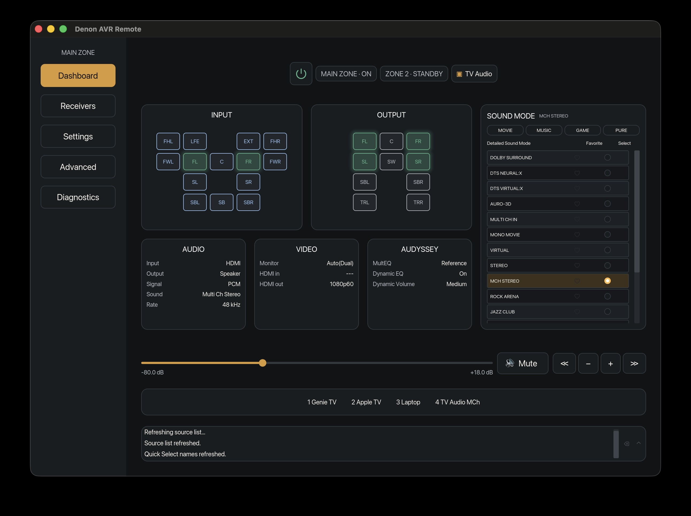

# Denon AVR Remote

**Your Denon receiver, on your desktop and in your terminal. Native Rust, no web view, no cloud.**

A desktop app and a scriptable CLI for Denon and Marantz AV receivers on your local network. Validated on the AVC-X3800H. Other models stay read-only until they are proven.



## Why you will like it

- **One dashboard.** Power, volume (-80 to +18 dB), mute, inputs, sound modes with favorites, Zone 2 status, and live input/output channel maps, plus Audyssey, audio and video readouts.
- **It does not guess.** Every change reports whether it was sent and whether the receiver confirmed the new value (`Confirmed: true`). A write acknowledgement is never passed off as state.
- **Finds your receiver.** SSDP discovery, saved receivers by name, and a single control connection that is released when idle so other tools can use it.
- **Scriptable.** `get` and `set` commands with `--dry-run` to preview any change before it touches your amp.
- **Private.** Everything stays on your LAN. Logs are local, size-capped, and never uploaded.
- **Built to last.** A layered Rust workspace with enforced dependency boundaries (`make boundary`), property tests, and replay tests of real receiver traffic.

## Try it in two minutes

Needs [Rust](https://rustup.rs) and a receiver on your network.

```text
git clone https://github.com/pastry-personal5/denon-avr-remote-multi-platform.git
cd denon-avr-remote-multi-platform

make run-gui                                          # desktop app
make run ARGS="get receivers"                         # discover receivers
make run ARGS="set volume -30.0 --dry-run --receiver 1"   # preview, sends nothing
```

Prefer an app bundle? `make package-macos` builds an unsigned Apple Silicon app and DMG. Source and release notes for each version are on the [Releases page](https://github.com/pastry-personal5/denon-avr-remote-multi-platform/releases).

## Roadmap

Version 4 is building a policy-gated Control API so AI agents can drive a receiver safely. The Control API server is built; MCP servers are planned, not shipped.

## Star it, fork it, tell a friend

If this saved you a trip to the remote, a [star](https://github.com/pastry-personal5/denon-avr-remote-multi-platform) helps other Denon owners find it. You can also [fork it](https://github.com/pastry-personal5/denon-avr-remote-multi-platform/fork) and make it yours under Apache-2.0, or [open an issue](https://github.com/pastry-personal5/denon-avr-remote-multi-platform/issues) with the model you are running and what you would like it to do.

## Documentation

See the [documentation map](docs/README.md) for user guides, architecture, contribution rules, commands, research evidence, active work, and historical records.

## License

Licensed under the [Apache License, Version 2.0](LICENSE).
